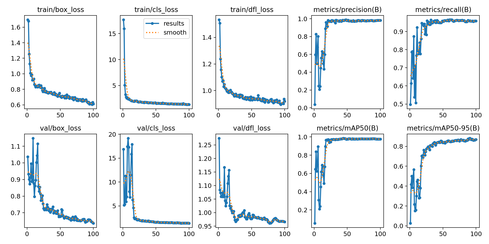
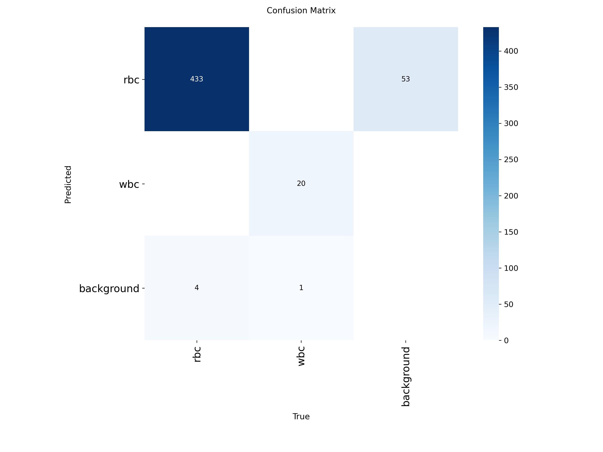
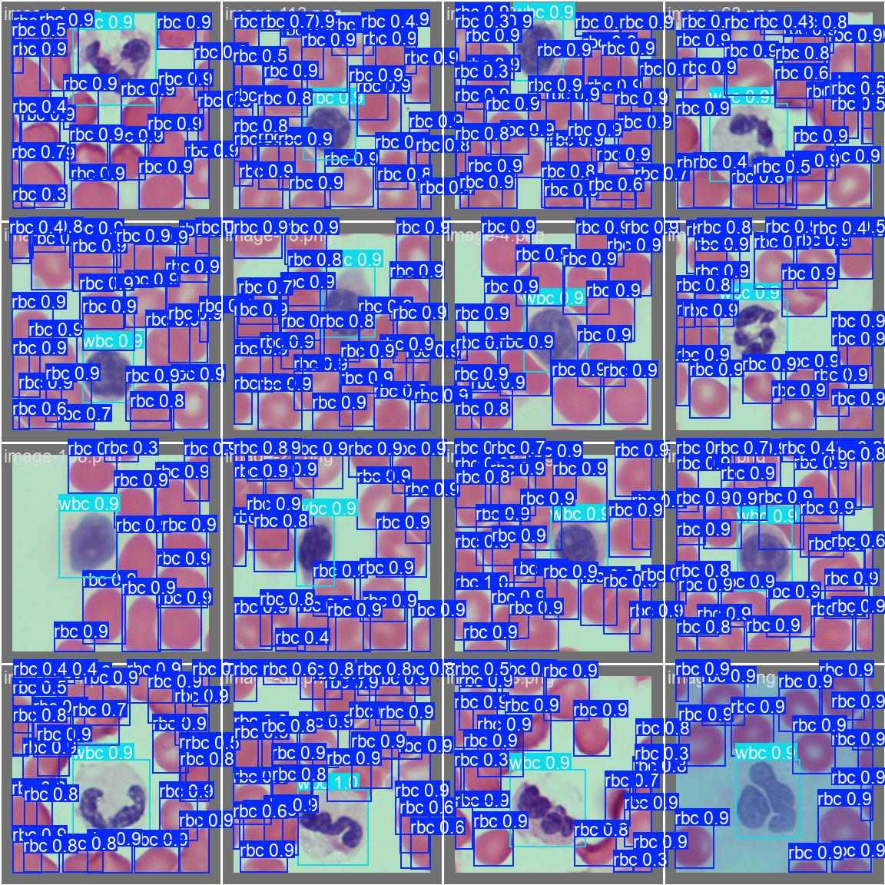

# blood-cell-detection
# 🔬 Blood Cell Detection using YOLOv8

## 📌 Project Overview
Automated detection and counting of **Red Blood Cells (RBC)** and 
**White Blood Cells (WBC)** from peripheral blood smear images using YOLOv8.

## 📊 Dataset
- **Source**: Kaggle - Blood Cell Detection Dataset
- **Images**: 100 annotated images (256x256 px)
- **Annotations**: RBC: 2237 | WBC: 103

## 🏆 Results
| Metric    | Value |
|-----------|-------|
| mAP@50    | 0.985 |
| Precision | 0.981 |
| Recall    | 0.951 |
|F1 Score   | 0.966 |
## 📈 Results

## 🔀 Confusion Matrix

## 👁️ Predictions vs Ground Truth

## 🛠️ Tech Stack
- YOLOv8 by Ultralytics
- Python
- OpenCV
- Kaggle

